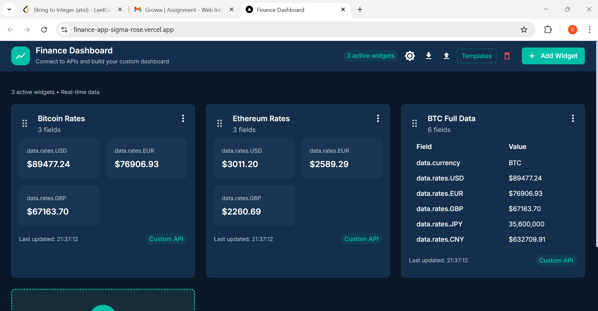
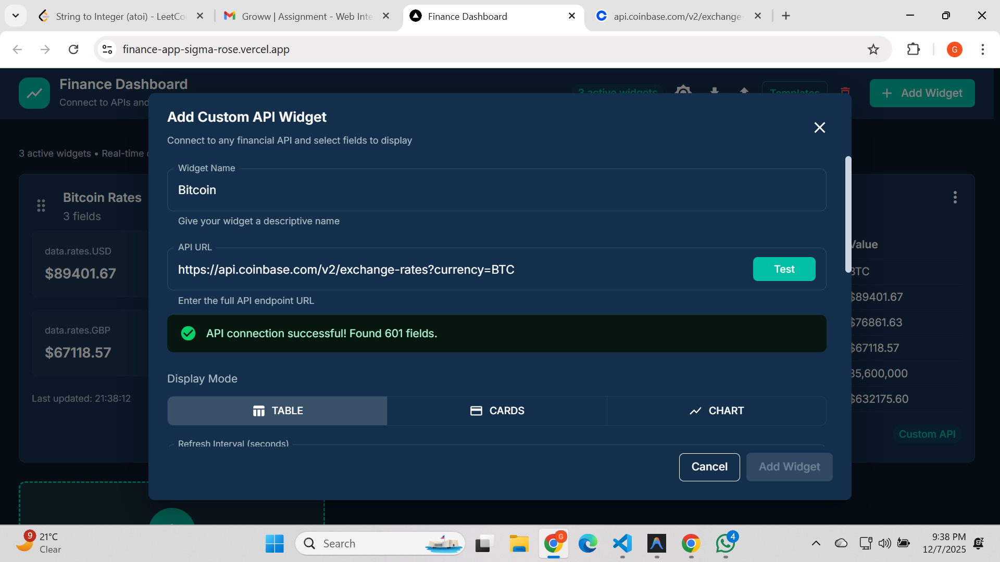
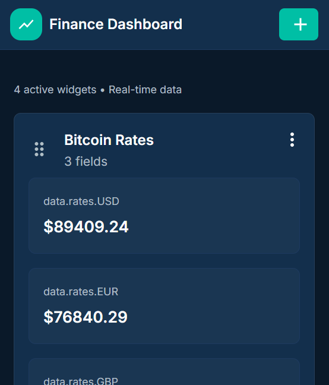

# Finance Dashboard

A customizable, real-time finance dashboard built with Next.js and Material-UI. Create, arrange, and monitor financial data widgets with drag-and-drop functionality.

## Live Demo

**[View Live Demo](https://finance-app-sigma-rose.vercel.app/)**

## Screenshots

### Desktop View
[](./public/image.png)

### Tablet View
[](./public/image2.png)

### Mobile View
[](./public/image3.png)

## Features

- **Customizable Widgets** - Add and configure widgets to track stocks, crypto, forex, and more
- **Real-time Data** - Live updates from financial APIs
- **Drag & Drop** - Rearrange widgets with intuitive drag-and-drop
- **Dark/Light Mode** - Toggle between themes
- **Import/Export** - Save and share dashboard configurations
- **Fully Responsive** - Optimized for desktop, tablet, and mobile
- **Templates** - Pre-built dashboard layouts to get started quickly

## Quick Start Guide

### Try Adding a Widget

1. Open [http://localhost:3000](http://localhost:3000)
2. Click **"Add Widget"** button
3. Enter API URL:
   ```
   https://api.coinbase.com/v2/exchange-rates?currency=BTC
   ```
4. Click **"Test"** to fetch data
5. Select fields like:
   - `data.rates.USD`
   - `data.rates.EUR`
6. Click **"Add Widget"** to create your widget!

The widget will appear on your dashboard showing real-time Bitcoin exchange rates.

## Getting Started

### Prerequisites

- Node.js 18+
- npm or yarn

### Installation

```bash
git clone <repository-url>
cd finance-dashboard

npm install

npm run dev
```

Open [http://localhost:3000](http://localhost:3000) in your browser.

## Usage

1. **Add Widgets** - Click "Add Widget" to create new widgets
2. **Configure** - Select data source (API) and customize fields
3. **Arrange** - Drag widgets to rearrange your dashboard
4. **Save** - Export your configuration for later use
5. **Templates** - Use pre-built templates or create your own

## Tech Stack

- **Framework:** Next.js 16
- **UI Library:** Material-UI (MUI)
- **State Management:** Redux Toolkit
- **Drag & Drop:** @hello-pangea/dnd
- **Charts:** Recharts
- **Styling:** Tailwind CSS + Emotion
- **Language:** TypeScript

## Available Scripts

```bash
npm run dev
npm run build
npm run start
npm run lint    
```

## Project Structure

```
finance-dashboard/
├── src/
│   ├── app/              # Next.js app directory
│   ├── components/       # React components
│   │   ├── Dashboard/    # Dashboard-specific components
│   │   ├── ui/           # Reusable UI components
│   │   └── widgets/      # Widget components
│   ├── services/         # API services
│   ├── store/            # Redux store & slices
│   ├── types/            # TypeScript types
│   └── utils/            # Utility functions
└── public/               # Static assets
```

## Example APIs to Try

- **Coinbase (Crypto):** `https://api.coinbase.com/v2/exchange-rates?currency=BTC`
- **CoinGecko (Crypto):** `https://api.coingecko.com/api/v3/simple/price?ids=bitcoin&vs_currencies=usd`
- **Exchange Rates:** `https://api.exchangerate-api.com/v4/latest/USD`

## License

MIT
